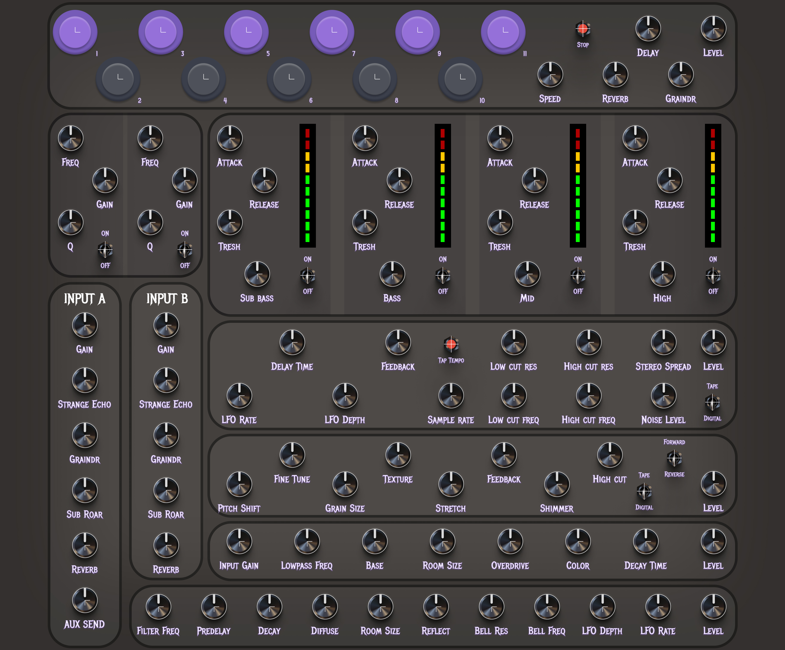
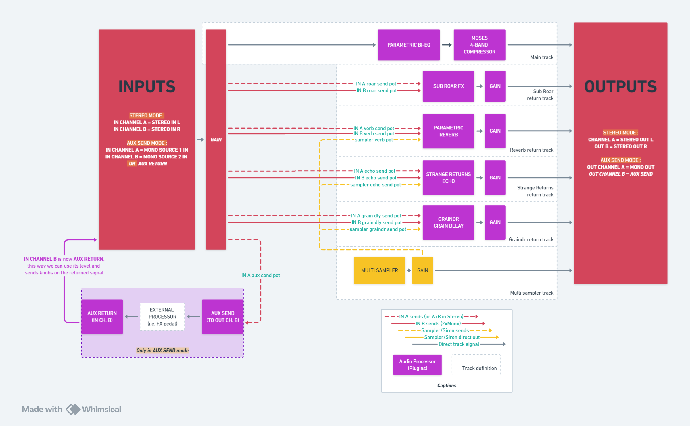

# 🚨PROJECT TROUBLEMAKER🚨 - 👷‍♂️WORK IN PROGRESS👷‍♂️
### The original dub soundsystem-style, fully digital, open source music preamp, based on ELK Audio OS.

This project is meant to be a fully digital sound system preamp, with a lot of features and a lot of fun to use. 
This would typically be used in a dub sound system control tower, right before the DSPs and power amps.
I am making it for [my own dub sound system](https://linktr.ee/mooncrownsoundsystem), but I am sharing it with the world so that everyone can enjoy and contribute to it.

### **_[Figma design of the front plate (click to open in figma) :](https://www.figma.com/design/a7w33TZh6XjIDETXx0zezs/PROJECT-TROUBLEMAKER?node-id=2-57&t=kPiumWiky9OcTQFE-1)_**

Please note that this project is still in its early stages, and it is not yet ready for use.
Also, the aim is not to provide a classic preamp to use with a microphone, but rather a preamp to use with a line-level signal, like a CD player, a computer, a synthesizer, etc.
It will NOT provide any protection for your speakers, and also will not split the signal into multiple bands outputs. 

It is meant to be used with a DSP that can handle multiple outputs, and optionally a mixer before it, to get microphone inputs and other line-level inputs.

**At the moment, the inputs and outputs are stereo only**, but more input modes will be added in the future (see Signal Flow section).

# Software & Hardware stack
Project Troublemaker is based on [ELK Audio OS](https://elk-audio.github.io/elk-docs/html/index.html), which is a Linux-based realtime audio OS that can run VST3 plugins.  
It is **_HIGHLY RECOMMENDED_** to get a grasp of ELK Audio OS before diving into this project.

I use a [Raspberry pi 4 (8GB)](https://www.raspberrypi.com/products/raspberry-pi-4-model-b/) as the main board, 

a [HifiBerry DAC+ ADC Pro](https://www.hifiberry.com/shop/boards/hifiberry-dac-adc-pro/), to get audio I/O,

a [Teensy 4.1](https://www.pjrc.com/store/teensy41.html) as the control board, which acts as a MIDI controller and communicates with the Raspberry Pi via USB.

To build the control panel I use [CD74HC4067 multiplexers](https://www.amazon.fr/ICQUANZX-CD74HC4067-Analogique-Multiplexeur-Num%C3%A9rique/dp/B07VF14YNG), and a lot of [arcade buttons](https://www.smallcab.net/sanwa-obsc-24mm-translucent-pushbutton-purple-p-2462.html), [potentiometers](https://www.amazon.fr/dp/B07B64MWRF?ref=ppx_yo2ov_dt_b_fed_asin_title), [RGB LED sticks](https://fr.aliexpress.com/item/1005006344542138.html), and [switches](https://amazon.fr/dp/B09W4HBXJ7).

The project is meant to be a fully open source project, with all the source code and hardware design files available for free.

**_Because I strongly believe that music is meant to be shared, and music gear should be open source._**

Please feel free to contribute by opening a PR or an issue. 

**_Keep in mind that I am still learning, and that I am doing this project in my free time_**, so I may take some time to get back to you and updates may be slow.

# Featured Plugins (Work in Progress)
- **_[SampleTower](https://github.com/LeoFabre/SampleTower)_** : My JUCE-based VST3 sample player. features 11 fully-loaded-in-RAM sample slots, real-time playback speed control, sample loading from the file system (via config file), sample triggering with a MIDI note, one-shot and loop modes for each sample (via config file), kill button that stops all currently playing samples.
- 2 parametric EQs with bypass switches.
- **_[Moses](https://github.com/LeoFabre/Moses)_** : My fork of [IEM's multiband compressor](https://git.iem.at/audioplugins/IEMPluginSuite/-/tree/master/MultiBandCompressor?ref_type=heads). It is a 4-band SIMD optimized multiband compressor/crossover plugin, featuring cascaded Butterworth, linkwitz-riley filters and Allpass filters, solo&kill switches and master controls.
- **_[Strange Returns](https://github.com/LeoFabre/StrangeReturns-CMake)_** : My fork of JackWithOneEye's [Strange Returns](https://github.com/JackWithOneEye/StrangeReturns) delay plugin. 
- **_[Graindr](https://github.com/LeoFabre/Graindr)_** : My fork of JackWithOneEye's [Graindr](https://github.com/JackWithOneEye/Graindr), dual granular delay plugin.
- **_Parametric Reverb FX_** : A parametric reverb that I have yet to design. The reverb pots on the frontplate are inspired by ableton's reverb plugin, and are subject to change.
- **_Sub Roar FX_** : A classic dub sub bass roar effect based on saturation, and filtering, and reverb. It is only composed of BrickWorks plugins that ELK Audio OS provides, I may or may not make a JUCE version of it in the future.

# [Signal Flow (click to open in whimsical)](https://whimsical.com/project-troublemaker-signal-flow-PksJ2XxrEqBQ8Brrcc3UFW)

## Input modes
- **_Stereo mode_**: The default mode, where the HifiBerry is used as a stereo input and output.
- **_Aux send mode_** (to be implemented): The 2 stereo channels of the HifiBerry are split in 2 mono input channels and 2 mono output channels.   
The first mono input channel is used as the main input, the first mono output is used as the main output, the second mono input channel is used as the aux send, and the second mono input channel is used as the aux return.   
This is useful to send the signal to an external effect processor and get it back in the preamp, like a reverb or a delay, and then use the preamp's processing on it.

As of now, the modes are not implemented, and the preamp only works in stereo mode.  
In the future, I will add a switch to select the input mode at boot time (Sushi would then get its processor graph built by the glue app via gRPC instead of the config file).